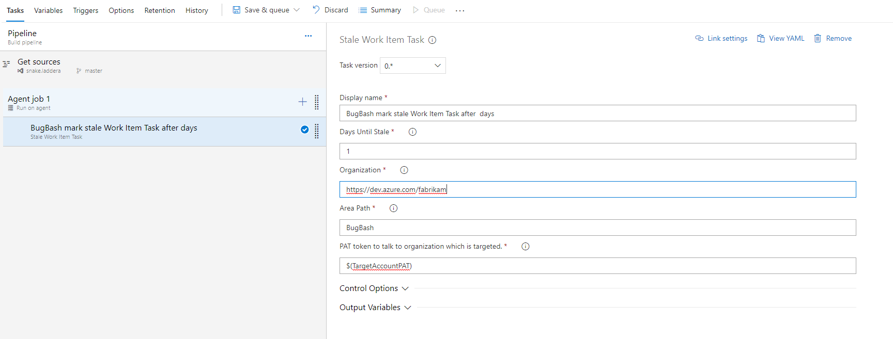
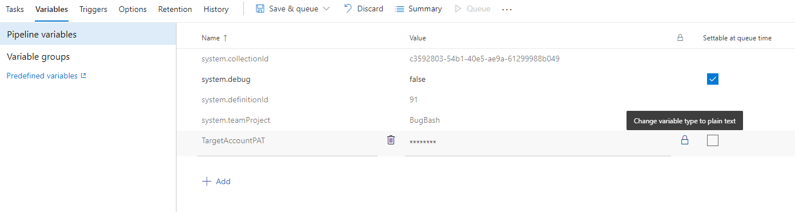

# DevOps Automation Tools

These build steps will help you to automate Azure DevOps work which you need to do repeatedly.
Published at : <https://marketplace.visualstudio.com/items?itemName=devopsCli.devopsAutomation>

## Stale Work Item Build Task

Add this build task into a build definition and trigger it periodically to mark work items with {ProAct: Stale} tag after N days (configurable) of inactivity.

Add it to the build like this:

Make sure to put PAT token in a secure variable in Build:

